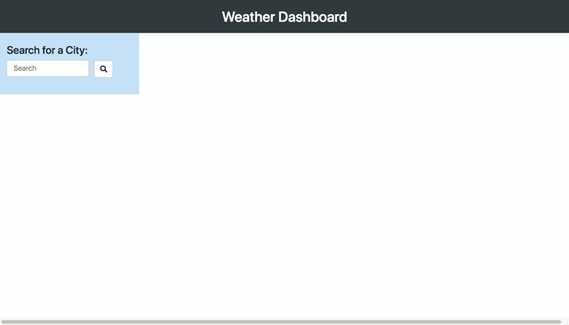

# Weather Dashboard

[Weather Dashboard - Deployed](https://jungjungie.github.io/Weather-Dashboard/)
 
[My GitHub](https://github.com/jungjungie)
 
[My Portfolio](https://jungjungie.github.io/)
 
 

## Description:

This weather application allows users to look up the weather in multiple cities. Built from HTML & Bootstrap, it is dynamically powered by jQuery. The app retrieves data real-time from the [OpenWeather API](https://openweathermap.org/api) and maintains a search history of up to 8 cities. 
 
 

**Application Features:**

- Users can search by city
- Data will pull current temperature, humidity, wind speed and UV index as well as a 5-day forecast
- UV index changes color based on risk of harm from unprotected sun exposure (low, moderate, high, very high)
- Search history saves up to 8 cities
- When a city is clicked from the search history, that city's data will populate

***
## Demo:

***
## Resources:

OpenWeather API: [https://openweathermap.org/api](https://openweathermap.org/api) 

UV Index Colors: [https://en.wikipedia.org/wiki/Ultraviolet_index](https://en.wikipedia.org/wiki/Ultraviolet_index)
