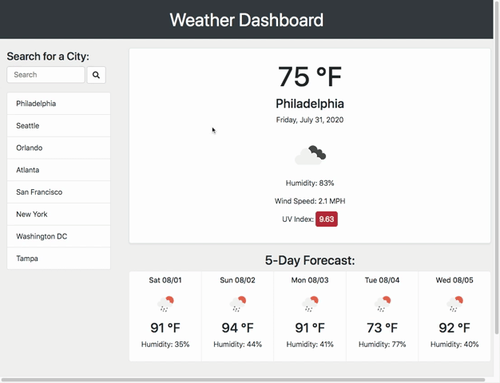

# Weather Dashboard

## Table of Contents
* [Description](#Description)
* [Demo](#Demo)
* [Contact](#Contact)
* [Resources](#Resources)

***
## Description:

**Deployed Link:** https://jungjungie.github.io/Weather-Dashboard/

This weather application allows users to look up the weather in multiple cities. Built from HTML & Bootstrap, it is dynamically powered by jQuery. The app retrieves data real-time from the [OpenWeather API](https://openweathermap.org/api) and maintains a search history of up to 8 cities. 

**USER STORY:**

~~~
AS A traveler
I WANT to see the weather outlook for multiple cities
SO THAT I can plan a trip accordingly
~~~

**APPLICATION FEATURES:**

~~~
GIVEN a weather dashboard with form inputs
WHEN I search for a city
THEN I am presented with current and future conditions for that city and that city is added to the search history
WHEN I view current weather conditions for that city
THEN I am presented with the city name, the date, an icon representation of weather conditions, the temperature, the humidity, the wind speed, and the UV index
WHEN I view the UV index
THEN I am presented with a color that indicates whether the conditions are favorable, moderate, or severe
WHEN I view future weather conditions for that city
THEN I am presented with a 5-day forecast that displays the date, an icon representation of weather conditions, the temperature, and the humidity
WHEN I click on a city in the search history
THEN I am again presented with current and future conditions for that city
WHEN I open the weather dashboard
THEN I am presented with the last searched city forecast
~~~

***
## Demo:

  

***
## Contact:
- **GitHub:** https://github.com/jungjungie
- **Portfolio:** https://jungjungie.github.io/

***
## Resources:

OpenWeather API: [https://openweathermap.org/api](https://openweathermap.org/api) 

UV Index Colors: [https://en.wikipedia.org/wiki/Ultraviolet_index](https://en.wikipedia.org/wiki/Ultraviolet_index)
